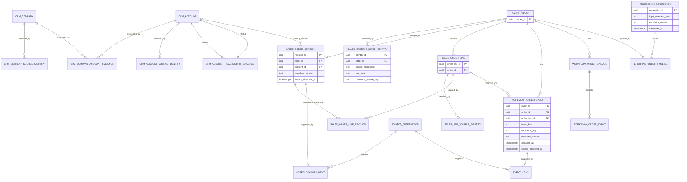

# First V1-to-V2 map: Sales Order Timeline

Status: Proposed relational design and implementation contract; source checkpoint
and focused live schema inventory observed on 2026-10-06. No business SQL or data
import is applied by this document.

## Recorded boundaries

| Boundary | Observed value | Meaning |
| --- | --- | --- |
| Completed local CSS checkout | `16bb3c2d1e14b59682a88f91e0fd7a98df1e1c12` | Clean and synchronized with origin/main; development source for this map |
| Live FSE-root repository | `9163fd3d73950b9c737672a47f6f6059d791ad75` | Runtime repository observed at 11:52:38 UTC / 12:52:38 BST |
| Live immutable Control V1 web release | `26ecb133833c30d26414901480d5c2fa49d9a0e1` | Current web release, distinct from the runtime repository |
| Live database inventory | `css_app`, 11:58:17 UTC / 12:58:17 BST | Metadata for 20 selected relations; no source records or credential values exported |

The [inventory JSON](v1-schema-2026-10-06.json) contains relation existence, column
types and PK/FK/unique constraints. It is a focused inventory, not a full schema
dump: indexes, triggers, privileges, row populations and freshness were not
attested by it. In particular, `ogl.current_order_header` does not exist;
`ogl.current_order_line` does. A missing relation is not evidence of missing orders.

These checkpoints do not freeze business data or attest that every feature in
the local checkout is running in V1. An actual export needs a consistent snapshot,
registered database/source instance, population and continuation watermark.
Neither a V1 deployment nor a V1 database change was made for this inspection.

## Proposed destination and treatment

| V1 evidence / owned state | V2 destination | Migration law |
| --- | --- | --- |
| `sculptor_live.observation` | Existing `integration.source_observation` plus intake manifest/identity mapping | Preserve original key, reader/schema/hash, source instance and observation time; append-only replay |
| `business_snapshot` and `business_snapshot_line` | `sales.order_revision`, `sales.order_line_revision` and retained input links | Header/line bundle and coverage are revision evidence; snapshot ID is not order identity |
| `crcust` / `latest_crm_company` | `crm.company`, company source identity and evidenced company-account association | `crmcref` identifies the CRM company; payload `cref` is a ledger reference |
| `crcontact` / `latest_crm_contact` | `crm.contact` with original company/contact identity | Preserve `(crmcref, contactno)`; contact names/emails do not join identities |
| Ordering customer reference, reviewed account links | `crm.account`, account source identities, relationship evidence/current projection | Keep separate ordering accounts; parent, invoice and price-source links remain distinct |
| Native orders / orditem snapshots | `sales.order`, `sales.order_line` and explicit source identities | Durable V2 IDs with scoped source keys; resolve line identifiers before joining |
| Complete/hot BWMS rows and transitions | `fulfilment.order_event` + event input links | Preserve native row grain and both comparison endpoints; exclude duplicate coverage |
| Delivery-note capture/header/line observations | Separate delivery-note evidence lane in `fulfilment.order_event` | Retain full seven-field semantic identity, corrections and currency policy |
| `fulfilment.current_despatch_line_fact` | Retained settled evidence and separate settled-despatch projection | Preserve exact q31/source identity and provenance; current view is not the evidence ledger |
| `workflow_episode`, `workflow_event` | `workflow.order_episode`, `workflow.order_event` and explicit legacy mappings | Preserve operator intent/history, original actor IDs and timestamps; classify source-derived state |
| Customer policy sets/rules, promise overrides and decisions | Later `sla` policy/input/evaluation slice | Preserve definitions/history and owners; rebuild calculation output under versioned V1 formulas |
| OGL current views, evaluated queues and progress projections | Reconciliation inputs / rebuilt reporting projections | Do not copy a mutable read model as a new authority |
| V1 `auth` | Separate compatible authentication continuity lane | Preserve password hashes, MFA and recovery state under one writer; see auth runbook |

Every included view must be backed by retained input evidence or an immutable,
manifested snapshot of its result. Re-reading a changing view is not a replay.
The first order slice does not require migrating all contacts, product families,
purchasing, invoices or Promise output tables at once.

## Identity rules

- Register source instance, company/ledger scope and database identity epoch
  before export. Database sequence values are only unique inside that epoch.
- CRM company key: `crmcref`. Ordering account key: the contracted ledger
  customer reference. A company-account association needs evidence; neither
  shared names nor reference similarity prove a one-to-one relationship.
- Current source contracts name order header key `(cref, ordno)` and native
  order-line key `(ordno, itemno)`. Retain company/source scope around both.
  Resolve the owning header unambiguously; a bare order number is insufficient.
- `uniqueno`, `itemno`, snapshot `line_no` and V1 workflow `order_number`
  remain separately named identifiers. No arithmetic, positional or equality
  assumption may convert one into another.
- A current/archive move retains the canonical order ID only after an accepted
  cross-file identity mapping proves continuity. An unresolved alias is retained
  as unmatched evidence rather than guessed.
- Canonical UUIDs are allocated once and recovered through persistent,
  database-unique source-identity mappings on replay. Reference changes require
  evidenced aliases; they must not silently generate a second order.
- Account relationships follow [ADR 0002](../architecture/0002-evidence-backed-account-relationships.md).
  No invoice or price-source link implies a parent link. Relationship acceptance
  is separate from importing account identities.

## Proposed entity diagram

The diagram shows the first slice's business grain and evidence connections.
Table names are proposals; only `integration.source_observation` already exists.
Identity namespaces include registered source/company scope. Optional event-line
links remain null when the order is known but its line mapping is unproved.

A line-revision FK must prove that its line and header revision belong to the
same order. An event's optional line FK must belong to its order. Source identities
are unique by namespace/key kind/canonical key; explicit entity FKs avoid a
polymorphic link that the database cannot validate. Append-only events are unique
by derivation key and translator version. A selected projection generation uses
one accepted interpretation version per lane; replaying or upgrading translators
does not add both interpretations into current totals.

Each revision retains all contributing observation IDs, snapshot membership,
coverage and input hashes. Each event retains its evidence inputs and comparison
window where applicable. A generation records exact input versions/watermarks,
coverage, reconciliation result and calculated time; its current pointer moves
only after the complete generation is committed.

## Event and metric separation

| Lane | Allowed meaning | Evidence limit |
| --- | --- | --- |
| Order snapshot | Observed commercial fields and line membership | Presence alone does not prove confirmation, closure or invoice/payment state |
| Scanner-confirmed pick | Positive equal pick/scan deltas at exact BWMS identity | Comparison window, not a known physical event timestamp |
| Warehouse despatch | Positive despatched delta at exact BWMS identity | No value inference; ordered-code/component grains stay separate |
| Delivery-note posting | Native line despatched quantity and goods value | Business date/raw time retained; capture time is different |
| Settled despatch | Exact matched settled commercial evidence | Settlement is not invoice, payment or revenue |
| Operator workflow | Recorded CSS-owned action/decision | Separate from ERP lifecycle; source refresh cannot erase it |

The direct current-day Sales Status publisher retains a summary rather than
individual rows. Its sales-status formula cannot manufacture line timeline events.
No invoice, payment or revenue lane is enabled by this first mapping.

## Required evidence before enabling each lane

1. Prove header/line/customer scope and the `itemno` to `uniqueno` mapping
   over the accepted population, including kit/component and amended/split lines.
   Unresolved mappings remain counted and visible.
2. Reconcile delivery-note semantic identity
   `(delno, delsfx, printind, ordno, itemno, kitind, uniqueno)` with V1's
   stored PK, which omits `unique_no` after `capture_id`. Inspect native
   schema/reader behavior and aggregate collisions; absence of stored collisions
   alone cannot prove records were never collapsed before insertion.
3. Prove complete/hot BWMS overlap and counter reset/correction handling.
   Two different transition IDs may still describe the same physical movement.
4. Record dataset-specific currency, units, native date/timezone and freshness/
   coverage policies. Preserve V1's scoped blank-currency inclusion rule;
   do not silently broaden it to every currency or dataset.
5. Export durable workflow/policy state with actor mappings and original versions.
   Check historical references and unresolved orders before granting V2 writes.
6. Produce snapshot/catch-up manifests, duplicate/conflict counts, parity results
   and an isolated populated restore. A Git commit is not a database watermark.

The [capability contract](../source-contracts/0002-sales-order-timeline.md) gives
the adapter, replay, projection and acceptance laws. These gates can be completed
lane by lane; uncertainty in finance does not block a clearly labelled order
snapshot. Pending lanes show `UNKNOWN`, `PARTIAL` or `BLOCKED`, never invented
completion or a zero total.

## Delivery sequence from this checkpoint

1. Add the smallest forward-only business migration after proving the first
   identity contract. Preserve applied `0001_foundation.sql`.
2. Implement bounded V1 evidence export and versioned intake with stable replay
   identities; keep payloads and secrets outside Git.
3. Implement order snapshot translation and a rebuildable timeline projection.
4. Add warehouse and delivery/settled lanes as their independent gates pass.
5. Connect preserved V1 authentication, then the read-only API and redesigned UI.
6. Shadow the same accepted population against V1 before any command cutover.

Continue product work in Control. Use CSS for the pinned contracts, evidence,
reconciliation and necessary V1 fixes; later V1 changes require a new checkpoint.

## Pinned CSS evidence

All links below refer to the completed local source commit. Deployment and
authority must be verified separately.

- [Native dataset keys and acceptance flags](https://github.com/0stoya/CSS/blob/16bb3c2d1e14b59682a88f91e0fd7a98df1e1c12/config/sculptor_live_source_contract_v1.json)
- [Native order-line discovery](https://github.com/0stoya/CSS/blob/16bb3c2d1e14b59682a88f91e0fd7a98df1e1c12/services/connector/sculptor_business_line_discovery_templates.py)
- [Immutable observations](https://github.com/0stoya/CSS/blob/16bb3c2d1e14b59682a88f91e0fd7a98df1e1c12/sql/postgres/003_sculptor_live_observations.sql)
- [Business snapshots](https://github.com/0stoya/CSS/blob/16bb3c2d1e14b59682a88f91e0fd7a98df1e1c12/sql/postgres/007_sculptor_live_business_snapshots.sql) and [later line-cap change](https://github.com/0stoya/CSS/blob/16bb3c2d1e14b59682a88f91e0fd7a98df1e1c12/sql/postgres/018_sculptor_business_large_order_line_cap.sql)
- [CRM company/contact projection](https://github.com/0stoya/CSS/blob/16bb3c2d1e14b59682a88f91e0fd7a98df1e1c12/sql/postgres/030_sculptor_live_crm_company_contact.sql)
- [BWMS capture grain](https://github.com/0stoya/CSS/blob/16bb3c2d1e14b59682a88f91e0fd7a98df1e1c12/sql/postgres/040_sculptor_live_current_picking_bwms.sql)
- [BWMS transition storage](https://github.com/0stoya/CSS/blob/16bb3c2d1e14b59682a88f91e0fd7a98df1e1c12/sql/postgres/064_sculptor_picking_bwms_transitions.sql)
- [Hot/complete overlay](https://github.com/0stoya/CSS/blob/16bb3c2d1e14b59682a88f91e0fd7a98df1e1c12/services/api/migrations/0064_sculptor_warehouse_hot_overlay.sql)
- [Delivery-note source contract](https://github.com/0stoya/CSS/blob/16bb3c2d1e14b59682a88f91e0fd7a98df1e1c12/docs/modernisation/SCULPTOR_LIVE_DELIVERY_NOTE_CAPTURE.md)
- [Delivery/settled projection and exact exclusion](https://github.com/0stoya/CSS/blob/16bb3c2d1e14b59682a88f91e0fd7a98df1e1c12/services/api/migrations/0069_sculptor_delivery_note_operational_projection.sql)
- [Sales Status summary scope](https://github.com/0stoya/CSS/blob/16bb3c2d1e14b59682a88f91e0fd7a98df1e1c12/docs/modernisation/SCULPTOR_SALES_STATUS_PUBLICATION.md)
